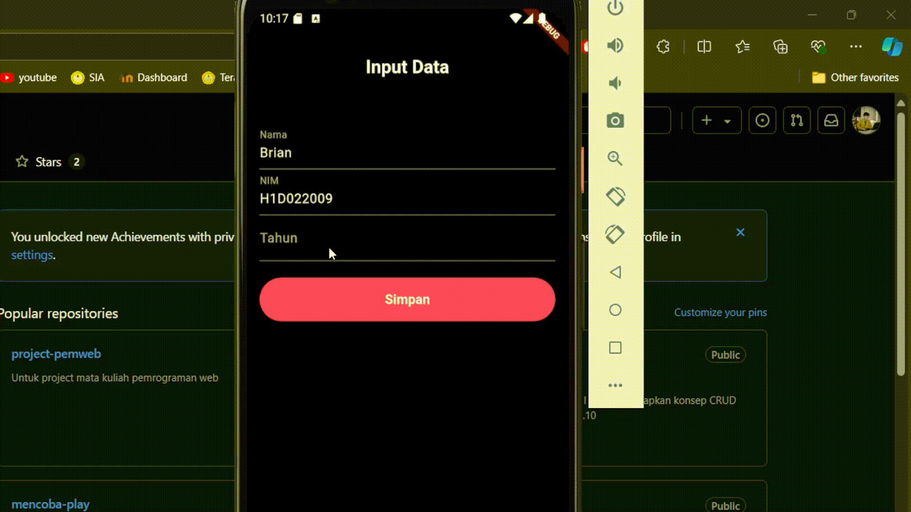

Nama        : Brian Cahya Purnama

NIM         : H1D022009

Shift Baru  : D

Shift Lama  : C

# Proses Pengiriman Data dari Form ke Tampilan
## 1. InputData di FormData

Pertama, dalam widget FormData (form_data.dart), kita memiliki tiga TextEditingController:
```
final _namaController = TextEditingController();
final _nimController = TextEditingController();
final _tahunController = TextEditingController();
```
Controller ini terhubung ke masing-masing field teks untuk nama, NIM, dan tahun.

## 2. Pengumpulan Data
Selanjutnya saat pengguna menekan tombol "Simpan", metode _tombolSimpan() dipanggil. Metode ini mengumpulkan data dari field teks:
```
String nama = _namaController.text;
String nim = _nimController.text;
int tahun = int.parse(_tahunController.text);
```

## 3. Pengiriman Data ke TampilData
Lalu, data yang terkumpul kemudian akan dikirim ke widget TampilData menggunakan metode Navigator.push():
```
Navigator.of(context).push(MaterialPageRoute(
    builder: (context) =>
        TampilData(nama: nama, nim: nim, tahun: tahun)));
```
Dengan ini akan membuat rute baru dan mendorongnya ke dalam tumpukan navigasi, mengirimkan data yang terkumpul ke konstruktor TampilData.

## 4. Menampilkan Data di TampilData
Setelah itu, widget TampilData (tampil_data.dart) menerima data melalui konstruktornya:
```
class TampilData extends StatelessWidget {
  final String nama;
  final String nim;
  final int tahun;

  const TampilData({
    Key? key,
    required this.nama,
    required this.nim,
    required this.tahun,
  }) : super(key: key);
}
```

## 5. Menampilkan Data yang Diterima
Dan akhirnya dalam widget TampilData (tampil_data.dart), data yang diterima digunakan untuk membangun tampilan:
```
@override
Widget build(BuildContext context) {
  final int umur = DateTime.now().year - tahun;

  _buildInfoCard("Nama", nama),
  _buildInfoCard("NIM", nim),
  _buildInfoCard("Umur", "$umur tahun"),
}
```
Dengan begini, widget TampilData mengambil data yang dikirimkan dari FormData, serta mengolahnya (untuk menghitung umur), dan menampilkannya kepada pengguna.

## Demo
